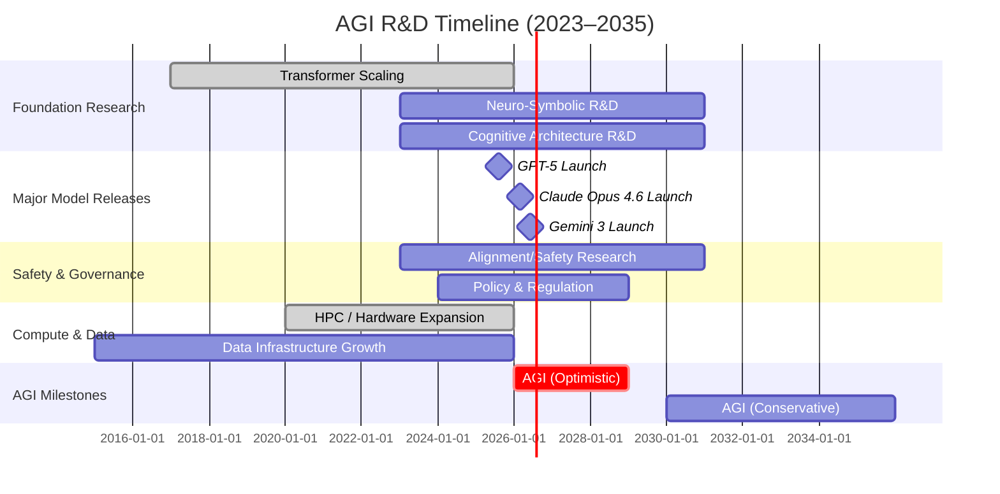

# Artificial General Intelligence (AGI)
Artificial General Intelligence (AGI) refers to AI systems with broad, human-like cognitive abilities – the capacity to learn, reason, plan, and adapt across diverse domains【1†L21-L24】【2†L38-L42】. Unlike today’s narrow AI, AGI would exhibit flexible generalization, common-sense understanding, and lifelong learning.  Leading AI labs (e.g. OpenAI, DeepMind, Anthropic) and governments are investing heavily in AGI research. Major foundation models like GPT-4/5 and Google’s Gemini have shown *emergent* cross-domain capabilities【14†L72-L81】【16†L64-L72】, prompting some experts to view them as early “proto-AGI” systems. Yet these models still lack true understanding, efficient learning, and embodied intuition【64†L427-L435】【64†L456-L460】.  

This report surveys AGI definitions, requisite capabilities, architectures, evaluation benchmarks, and current progress.  We compare approaches (e.g. large transformer models, neuro-symbolic systems, cognitive architectures, modular agents, reinforcement learners, meta-learning and hybrids) with their strengths and weaknesses. Benchmarks range from classic tests (the Turing test, employment tests) to modern proposals (Abstraction and Reasoning Corpus, Tong test, AGI-Score frameworks) designed to measure generality, robustness, and efficiency【3†L44-L49】【35†L75-L84】【31†L63-L72】【33†L55-L64】.  The state of the art includes OpenAI’s GPT-5 (2025)【40†L137-L144】, Google DeepMind’s Gemini 3 (2026)【44†L421-L430】, and Anthropic’s Claude Opus 4.6 (2026)【51†L424-L431】.  Labs claim rapid improvement (GPT-5 being “a significant leap in intelligence”【40†L137-L144】), and many experts regard AGI by 2030 as within possibility【57†L1-L4】, though this is highly uncertain. Key challenges remain: **learning efficiency** and **energy use** (brains use ~20W vs AI models needing megawatts【64†L427-L435】), **symbol grounding** and **common sense** (AI lacks innate physical/social intuition【64†L439-L444】【64†L456-L460】), **continual learning** (avoiding catastrophic forgetting【64†L448-L452】), and **robust generalization** outside training distributions【75†L182-L188】.  

AGI raises profound safety and societal issues. Ensuring *value alignment*, interpretability, verification, and control of powerful AI is critical. For example, Anthropic’s Claude 4.6 was rigorously audited to minimize misaligned behaviors (it showed extremely low rates of unsafe outputs)【51†L359-L366】. Governance proposals include international oversight, AI ethics guidelines, and strict testing (e.g. Peng’s Tong Test emphasizes physically- and socially-grounded evaluation【31†L63-L72】). Economically, AGI could drive unprecedented growth (one model predicts that 12.5% of “human generality” yields ~1% annual GDP boost【33†L122-L127】) but also massive job disruption and inequality. Mitigations like retraining, safety investment, and global cooperation are proposed.  

**Research Agenda:** In the short term (1–3 years), priorities include developing rigorous AGI benchmarks, scaling alignment and interpretability methods, and experimenting with hybrid architectures (e.g. combining LLMs with planners). In the medium term (3–7 years), efforts should focus on embodied multimodal agents (robots or sims integrating vision, language, touch), memory-augmented networks, and robust meta-learning. Long-term (7+ years) goals involve neuroscience-inspired architectures, provable safety mechanisms, and international governance structures. Table 1 compares major approaches and teams, and Figure 1 presents a projected timeline with key milestones and uncertainty ranges. 

# Definition and Variants of AGI  
Artificial General Intelligence (AGI) is broadly defined as an AI system whose capabilities “rival those of a human,” exhibiting versatile understanding, reasoning, and problem-solving across any domain【3†L44-L49】【2†L38-L42】.  In other words, AGI can perform any intellectual task a human can, adapting to new situations without domain-specific retraining. It is often equated with “strong AI” (human-level intelligence) as opposed to today’s “narrow AI,” which excels only on specific tasks【1†L21-L24】【2†L72-L77】. By these definitions, passing Alan Turing’s test – having human-indistinguishable conversational ability – is an indicator of AGI【3†L44-L49】.  

Experts also distinguish levels of generality. For example, *artificial superintelligence* (ASI) would vastly surpass human ability; *embodied AGI* implies integration with a physical robot body; and *domain-general AI* emphasizes transfer across modalities (vision, language, etc.). Current AI (e.g. ChatGPT) is often called “narrow” because it operates solely on text without true understanding, whereas AGI would fully integrate knowledge and skills. Some define AGI in stages (e.g. Ana et al. 2023), but most emphasize the core idea of autonomous, *multi-domain* learning and reasoning.  

# Core Capabilities for AGI  
Building AGI requires a rich set of cognitive skills. Key capabilities include:  

- **Learning & Meta-Learning:**  AGI should learn new tasks rapidly and efficiently, ideally with few examples. Humans excel at one-shot or few-shot learning, whereas current AI requires massive data. Bridging this “efficiency gap” is critical【64†L427-L435】. Meta-learning (training on diverse tasks so as to learn *how* to learn) is a promising technique【26†L62-L71】. For example, meta-learning algorithms aim to optimize a model so it can quickly adapt to new problems with minimal data【26†L62-L71】.  

- **Transfer and Generalization:**  The ability to transfer knowledge across domains (e.g. using language understanding to aid physical reasoning) is central to AGI. Effective transfer learning and compositional generalization allow a system to apply learned concepts in novel contexts. AGI would ideally master unsupervised learning and abstraction to form flexible world models.  

- **Continual Learning:**  An AGI must accumulate knowledge over time without catastrophically forgetting earlier learning. Unlike most neural nets, which overwrite old knowledge, humans continually integrate new experiences【64†L448-L452】. Overcoming *catastrophic forgetting* is a core challenge【64†L448-L452】.  

- **Common-Sense Reasoning:**  Core to human general intelligence is vast common sense about physics, society, and everyday life. AGI must have intuitive understanding (e.g. gravity, causality, social norms) that current models lack【64†L456-L460】. For instance, present AI often fails basic physics intuition or moral reasoning. Robust common-sense inference is therefore a key AGI capability【64†L456-L460】.  

- **Logical and Abstract Reasoning:**  Beyond pattern recognition, AGI should perform step-by-step reasoning (logical deduction, mathematical problem solving, planning). This involves causal reasoning, planning long action sequences, and solving puzzles.  

- **Language and Communication:**  Fluent, context-aware use of language (spoken or written) is essential. AGI must not only parse and generate language but also understand nuance, pragmatics, and possibly learn new languages. Modern large language models showcase remarkable progress here, but true AGI would use language as part of integrated reasoning.  

- **Perception and Embodiment:**  For embodied AGI (robots), perceptual capabilities like vision, speech, and tactile sensing must be integrated with motor control. Even for non-robotic AGI, understanding multimodal inputs (images, audio, video) is crucial. AGI systems are expected to navigate and interact with real or simulated environments, requiring fused perceptual-motor intelligence.  

- **Planning and Decision-Making:**  AGI must set and pursue goals in complex, dynamic environments. This entails foresight, contingency planning, and the ability to handle uncertainty. For example, an AGI assistant should decompose a high-level user goal into actionable steps in the real world.  

- **Creativity and Innovation:**  AGI should generate genuinely novel ideas or artifacts – solving open-ended problems, creating art or scientific hypotheses beyond its training. Current generative AIs can produce creative outputs, but AGI would ideally understand and deliberately innovate.  

Each of these capabilities interacts: an AGI would integrate perceptual input, store experiences, reason abstractly, and adapt continuously, similar to human cognitive systems.  

# Leading Architectures and Approaches  
Several research paradigms are pursued toward AGI, each with its own merits:

- 【84†embed_image】**Foundation Models (Scaling Transformers):**  The dominant trend is simply scaling up deep neural networks, especially transformer-based language (and vision) models. Large pretrained “foundation models” (e.g. OpenAI’s GPT series, Google’s PaLM/Gemini) have shown *remarkable generality*. Trained on vast multimodal data, they exhibit emergent abilities across domains【14†L72-L81】【16†L64-L72】. For instance, GPT-4 can perform math, coding, legal reasoning, etc., often at near-human levels. Bubeck et al. even call GPT-4 “an early (yet incomplete) version of an AGI system”【14†L72-L81】. The strengths of this approach are broad language understanding and transfer capabilities. However, these models are extremely **data- and compute-hungry**, prone to hallucinations, and lack grounded physical understanding. They also require tremendous resources (e.g. training runs of order 10^25 FLOPs by 2026【75†L165-L172】). Typical examples include GPT-4/5【14†L72-L81】, Google Gemini/PaLM, Meta’s LLaMA, and the conceptual scaling laws in Kaplan et al.’s work.

- **Neuro-Symbolic AI:**  This approach augments neural networks with symbolic reasoning and knowledge representations. The idea is to leverage deep learning for perception and pattern recognition, while using symbolic logic for explicit reasoning and world knowledge. Neuro-symbolic architectures aim to overcome the “shortcut” learning of black-box nets. Proponents (e.g. IBM) argue it is a key path to AGI【11†L6-L9】. Strengths include better interpretability and handling of abstract concepts. Weaknesses involve difficulty in scaling (symbolic modules require manual engineering) and integrating continuous and discrete systems. Examples include IBM’s Neuro-symbolic AI research【11†L6-L9】 and hybrid models like Neural Concept Learners. 

- **Cognitive Architectures:**  Inspired by cognitive science, these frameworks model human-like mental modules (memory, attention, reasoning). Examples are Soar, ACT-R, and OpenCog. Such architectures provide fixed computational structures and often explicitly model working memory, beliefs, and reasoning cycles. For instance, **OpenCog Hyperon** is an open-source AGI framework aiming for human-level cognition【19†L65-L74】. Strengths: they can incorporate insights from psychology (e.g. hierarchical memory) and support self-modification. Weaknesses: historically they have been narrow in capability (relying on handcrafted knowledge) and slow to scale up to modern compute. Timelines for fully realizing cognitive architectures into AGI are long-term.

- **Reinforcement Learning (RL) and Agents:**  RL trains agents via trial-and-error interaction, often with reward feedback. Notable successes (AlphaGo/Zero, MuZero, AlphaStar) show that RL can reach superhuman performance in complex games without human data. RL’s strength is learning from “first principles” and discovering novel strategies (e.g. AlphaGo’s Move 37)【24†L42-L50】. RL also supports continual learning in changing environments. However, pure RL is **sample-inefficient** and relies on simulators; agents often overfit narrow domains and lack transfer to new tasks【24†L42-L50】. Modern variations include multi-agent systems (emergent behavior in Hide & Seek) and world-model-based RL. These remain promising for embodied AGI (robots learning physical tasks) but face scalability challenges.

- **Meta-Learning (“Learning to Learn”):**  Meta-learning techniques train models on many tasks so they can adapt quickly to new ones【26†L62-L71】. For example, Model-Agnostic Meta-Learning (MAML) tunes a model’s initial weights to be amenable to rapid finetuning on new tasks【26†L62-L71】. This approach directly targets the few-shot learning goal of AGI. Strengths include strong adaptation from limited data; weaknesses are that meta-learning is typically demonstrated on narrow benchmarks and scales poorly to very large models. Research labs experiment with meta-RL and meta-optimization for AGI.

- **Modular and Agent-Based Systems:**  Some envision AGI as a society of specialized modules (or agents) that communicate. This could include an LLM “reasoning” core plus separate vision, memory, and motor modules, or independent sub-agents cooperating (multi-agent approaches). The modular view emphasizes decomposition of intelligence (e.g. using tools or calling external APIs). Strengths: flexibility, interpretability of modules. Weaknesses: complexity of orchestration, potential instability between components. Examples are chain-of-thought systems, LangChain/Auto-GPT agents that break down tasks, or DeepMind’s Pathways concept (multi-expert systems). 

- **Hybrid Systems (LLM + Logic/Search):**  Many practical systems today combine neural LLMs with explicit modules for reasoning or safety. For instance, IBM’s SOFAI-LM is a cognitive architecture that layers an LLM (“System 1”) with a symbolic planner (“System 2”)【20†L14-L22】.  Transformers with integrated retrieval or program execution (e.g. OpenAI’s WebGPT, Google’s RETRO) fall in this category. These hybrids aim to combine the broad knowledge of LLMs with precise computation or logic. The trade-off is engineering complexity and the challenge of smoothly integrating very different components. 

Table 1 (below) summarizes these approaches, their strengths, weaknesses, representative examples, and rough timelines.

# Benchmarks and Evaluation  
Measuring progress toward AGI requires evaluating generality, not just narrow task performance. Besides the classic **Turing Test** (indistinguishability from humans in conversation)【3†L44-L49】, many new proposals exist:

- **Turing and Employment Tests:**  The Turing Test is the foundational concept (AGI as good as a human interlocutor【3†L44-L49】). Other thought experiments include Wozniak’s “Coffee Test” (robot that can find and make coffee in any kitchen) and the “Employment Test” (can an AI perform an entire job role like a human?)【28†L100-L108】. These emphasize embodied, open-ended tasks beyond toy benchmarks【28†L100-L108】.

- **Abstraction & Reasoning Corpus (ARC):**  François Chollet’s ARC is a benchmark suite designed to measure “general fluid intelligence”【35†L75-L84】. It contains hand-designed tasks (pattern recognition puzzles) that require few-shot learning and generalization beyond simple statistical correlations. The ARC-AGI variants extend this idea to more difficult core-principle puzzles. Chollet argues that ARC follows human-like priors and can expose genuine reasoning ability【35†L75-L84】.

- **Tong Test and DEPSI (Peng et al. 2024):**  Peng et al. propose that AGI evaluation must involve **Dynamic Embodied Physical and Social Interactions** (DEPSI)【31†L63-L72】. They define five levels of AGI capability and introduce the “Tong Test,” a virtual environment where an agent must exhibit object permanence, social communication, causal manipulation, etc. This framework emphasizes that real AGI must act in (simulated) worlds, not just solve static puzzles.

- **AGI Testbeds:**  Matej Šprogar’s AGITB (Artificial General Intelligence Testbed) proposes 14 core tests (e.g. determinism, hierarchy, swap invariance) evaluated at the raw signal level【30†L244-L252】. A system must pass *all* tests simultaneously to qualify as AGI. This avoids simplistic metrics; each individual test is solvable by narrow AI, but no narrow system can satisfy the full suite【30†L244-L252】. Similarly, AGIBench (Tang et al. 2023) categorizes tasks by abilities/domains to stress generalization.

- **Composite “AGI Score”:**  Recent work (Hendrycks et al.) suggests combining performance across diverse domains (math, reading, coding, etc.) into a single metric【33†L55-L64】【33†L100-L107】. For example, an “AGI Score” might average scores on many benchmarks and penalize weaknesses (coherence-based scoring)【33†L73-L81】【33†L100-L107】. The idea is akin to IQ tests: an AGI must be at least reasonably competent everywhere, not super-human in one area and zero in another.

- **Generalization and Robustness Metrics:**  Evaluations should include out-of-distribution and adversarial tests. Metrics like sample-efficiency (how few examples to learn a new task) and resistance to bias/hallucination are increasingly used. For instance, model evaluations now often report “few-shot” learning curves and robustness benchmarks (e.g. randomized noun experiments, safety testing suites).

In practice, no single test is definitive. Research often uses aggregate benchmarks like MMLU or SuperGLUE to gauge general knowledge, but these alone do not prove AGI【14†L72-L81】. A comprehensive evaluation would combine formal tests (ARC, Tong, Turing) with continual real-world challenges and safety constraints, ensuring not only high performance but also aligned and robust behavior【28†L49-L57】【31†L63-L72】.

# Current State of the Art and Timelines  
AGI research is being driven by major tech labs, startups, and academic initiatives. Key developments and players include:  

- **OpenAI:** As of 2025, OpenAI’s flagship model is **GPT-5**, announced August 2025 as “a significant leap in intelligence”【40†L137-L144】. It is a unified multimodal model with advanced reasoning across code, math, text, vision and more. OpenAI has also built enormous compute infrastructure (e.g. a custom supercomputer with ~10,000 GPUs, 285,000 CPU cores【73†L99-L104】). In late 2023 Microsoft finalized a multibillion-dollar investment in OpenAI (reportedly up to \$10B)【61†L205-L214】, underscoring the high stakes. OpenAI claims rapid progress, but details of GPT-5’s architecture remain proprietary.    

- **Google DeepMind:** DeepMind (now part of Google) has released the **Gemini** series of models. Gemini 3 (2026) is reported as the “most intelligent model” with state-of-the-art reasoning and a massive context window【92†L430-L433】. It excels in multimodal tasks and code generation, setting new benchmarks on MMLU-type tests and coding competitions【92†L468-L477】. Google invests heavily in AI hardware (TPU clusters, H100 GPUs) and is also pursuing Alpha-series RL agents (e.g. AlphaFold for biology, AlphaCode for programming) as stepping-stones. DeepMind’s roadmap suggests iterative model releases (2.0, 2.5, 3.0, etc.) with increasing capabilities.  

- **Anthropic:**  Founded in 2021, Anthropic has produced the *Claude* family of models. Its latest, **Claude Opus 4.6** (Feb 2026), boasts an unprecedented 1,000,000-token context window【51†L424-L431】. Anthropic’s research emphasizes alignment: their evaluations show Claude 4.6 maintains extremely low rates of unsafe outputs (deception, sycophancy) compared to predecessors【51†L359-L366】. In 2023 Anthropic raised ~$7B (including Amazon’s \$4B investment)【61†L231-L235】, signaling strong commercial support. While Anthropic has not published firm AGI timelines, public statements by AI leaders (including Anthropic’s cofounders) have ranged from a few years to a decade.  

- **Microsoft / Others:**  Microsoft, Google, Amazon and Meta are all heavily funding AI. In just one quarter of 2026 Microsoft spent \$37.5B on capex (mostly GPUs and hardware) for AI and cloud infrastructure【60†L115-L123】. This includes dedicated Azure credits for OpenAI and Anthropic, which together constitute a large portion of Microsoft’s cloud backlog【60†L155-L163】. Meta has released LLaMA-family models as open research; they have built supercomputers (e.g. the 192-qubit AI research chip) and pursue AI across product lines. Academic and government projects (e.g. DARPA’s AI initiatives, EU research programs) also invest in foundational AI research, but the most visible progress is in industry labs.  

**Milestones and Timelines:** Despite rapid advancement, AGI timelines remain uncertain. Surveys of AI researchers show a wide spread – from the 2020s to beyond mid-century – with many experts giving a 25–50% probability of human-level AGI by 2030【57†L1-L4】. For instance, the 80,000 Hours report (2025) concludes that AGI by 2030 “is within the scope of expert opinion”【57†L1-L4】. High-level executives have become more bullish: DeepMind’s Hassabis has suggested “a matter of years” for significant breakthroughs, and even Musk’s AI lab (xAI) is publicly targeting AGI in the mid-2020s.  

However, history warns that hype often overshoots realities. Stanford’s 2026 AI Index reports that no group claims imminent AGI; most focus on stepwise milestones in capabilities and safety. Realistic forecasts typically show **uncertainty ranges**: for example, one industry analysis sets median AGI emergence around 2026–2030 (25% chance by 2029)【75†L145-L150】, but acknowledges wide error bars due to unknowns like algorithmic breakthroughs or compute limits. Notably, as systems scale up (GPT-5, PaLM, etc.), some emergent abilities appear (e.g. GPT-4 suddenly mastering biochemistry reasoning), supporting an *optimistic scaling hypothesis*. Yet *bottlenecks* like data quality, software architecture, and understanding causality remain.  

**Funding & Commitments:** The AGI effort has attracted hundreds of billions in potential funding. Microsoft’s multi-year investment in OpenAI (~\$10B reported)【61†L205-L214】, Amazon’s \$4B for Anthropic【61†L231-L235】, Google’s multibillion research budgets, and even new startups (e.g. OpenAI spin-offs) indicate massive capital flow. Governments are also planning: the U.S. National AI Initiative and China’s AI plans allocate tens of billions toward advanced AI R&D. Such resources are aimed at hitting intermediate milestones (e.g. fully autonomous software agents, advanced robotics) on the AGI path. The realistic picture is one of a technology race with high stakes, where progress is fast but bounded by fundamental challenges (see next section).  

# Key Technical Challenges and Research Gaps  
Despite recent advances, AGI research faces several open problems:

- **Learning Efficiency:**  Modern AI demands far more data and energy than humans do. As noted, “Human children learn remarkably efficiently from limited data…current AI systems require massive datasets and enormous computation”【64†L427-L435】. For example, GPT-3 used ~300B tokens of text【73†L85-L93】 and consumed megawatt-hours to train【64†L427-L435】. Bridging this *efficiency gap* is crucial – we need algorithms that learn general rules from few examples, akin to human learners【64†L427-L435】.  

- **Symbol Grounding & Embodiment:**  Language models today process symbols without real-world grounding【64†L439-L444】. An AGI must connect abstract symbols to sensory experiences. This requires embodied or multimodal learning: robots interacting in real or simulated worlds to form common-sense associations. The lack of physical grounding is linked to AI’s brittleness – e.g. it may know the word “apple” but not the taste or physics of throwing an apple.  

- **Continual Learning:**  Current models lack robust *continual learning*. They typically train once on a static dataset; new learning often erases old knowledge (catastrophic forgetting【64†L448-L452】). AGI should continually update its model of the world over years. Research in continual meta-learning, memory architectures, and dynamic networks is needed to fill this gap【64†L448-L452】.  

- **Common-Sense and Causality:**  Many AI failures stem from missing core intuitions. Deep networks excel at pattern-fitting but “lack robust common sense reasoning,” failing in basic physics, social cues, and causal inference【64†L456-L460】【75†L182-L188】. For example, LLMs frequently hallucinate facts or misinterpret cause-effect relations. Incorporating causal reasoning modules or training on causality-rich tasks is an active research gap.  

- **Interpretability and Debugging:**  AGI systems will be enormously complex. Understanding why a system made a decision is key for safety and trust. However, deep learning models are generally opaque. Better interpretability tools (e.g. attention analysis, circuit tracing, formal verification) are required. Without them, it will be difficult to audit AGI behavior or correct errors systematically.  

- **Scalability of Algorithms:**  The “scaling laws” suggest that performance improves smoothly with model size and data【75†L165-L172】. But recent work (Chinchilla, etc.) shows diminishing returns and challenges with data quality【75†L173-L178】. We also face hardware limits and energy costs. Future research must innovate beyond brute-force scaling – for instance, developing new neural architectures that inherently generalize (e.g. with relational or hierarchical structures), or leveraging unsupervised/world-model learning (reinforcement with intrinsic motivation).  

- **Algorithmic Alignment:**  Technically, ensuring an AGI’s goals align with human values is a profound challenge. This spans from robust reward specification to building in uncertainty about objectives. Research gaps include scalable oversight (methods like recursive reward modeling, AI safety via debate), uncertainty quantification, and safe self-modification techniques.  

- **Verification & Control:**  For powerful AGI, methods to formally verify behavior or impose hard safety constraints are lacking. Current formal methods don’t scale to modern ML. Control mechanisms (e.g. off-switches, circuit-breakers) must be designed into AGI from the ground up.  

- **Computational & Resource Constraints:**  Training exascale models requires enormous hardware and energy. We have begun to approach ~10^25 FLOPs in training runs【75†L165-L172】, but doing so sustainably is difficult. Building more efficient hardware (e.g. neuromorphic chips) and reducing algorithmic waste (sparser networks, better training algorithms) are open problems.  

In summary, while narrow AI has made giant leaps, AGI demands solving learning, reasoning, and integration challenges that current systems only partly address. This underscores the view that AGI will likely require new architectural innovations (see also【64†L514-L522】【75†L173-L178】).  

# Safety, Alignment, and Governance  
Developing AGI safely is as critical as making it capable. Key considerations include:

- **Value Alignment:**  Ensuring AGI’s objectives match human values is paramount. Misalignment could lead to harmful behavior even if unintended. Alignment research focuses on methods like inverse reinforcement learning, human-in-the-loop feedback, and learning from preferences. Anthropic’s testing of Claude 4.6 showed that with careful training, models can achieve “low rates of hallucination, sycophancy, etc.”【51†L359-L366】 – a sign of progress but also of required effort.  

- **Interpretability and Verification:**  Transparent AI (with explainable decision processes) helps detect misalignment. Research into formal verification of learning systems is needed to guarantee safety constraints (e.g. “it will never output that command under any input”).  

- **Control and Containment:**  Mechanisms to control an AGI’s influence are essential. This includes simple safeguards (off-switches, testing environments) and more complex ideas (boxing AIs in simulations or use of cryptography to limit AGI’s effects). The community debates if AGI should be built by a single powerful entity or collaboratively to ensure checks and balances.  

- **Security and Misuse:**  AGI technology has dual-use risks. Malicious actors might harness AGI for disinformation, autonomous weapons, biothreat design, or hacking. Robust cybersecurity, access controls, and international agreements are needed to mitigate misuse.  

- **Ethical & Societal Governance:**  AGI raises profound ethical questions (conscious rights? economic redistribution?). At the governance level, proposals range from an international “AI regulatory body” to national laws (like the EU AI Act) and industry best practices. For example, Future of Life Institute has advocated for research into global governance structures for powerful AI. Peng et al.’s Tong Test even implicitly calls for embedding ethics by testing agents in social contexts【31†L63-L72】.  

- **Oversight and Coordination:**  Because AGI impacts all of society, many experts argue for coordinated oversight. This could involve pre-deployment safety evaluations (like FDA for drugs), liability frameworks, and ongoing monitoring. The 2025 Bletchley Declaration and corporate charters (e.g. OpenAI’s founding “broadly distributed benefits” clause) reflect growing consensus on the need for ethical guidelines.  

Addressing these issues requires interdisciplinary effort: technical research on alignment and safe design, alongside policy work on regulation and public discourse. If AGI arrives, its “very big deal” impact【3†L75-L80】 will depend critically on how well these safety measures are implemented.  

# Compute, Data, and Scaling Considerations  
Achieving AGI will demand unprecedented computing resources and data:

- **Scaling Laws and Hardware:**  Empirical scaling laws (Kaplan et al. 2020) show that model performance improves predictably with increased compute, data, and parameters【75†L165-L172】. By 2026, training runs are on the order of 10^25 FLOPs【75†L165-L172】, thanks to clusters of NVIDIA H100 GPUs and custom AI accelerators. For context, GPT-3’s 175B parameter model was trained on 300 billion tokens【73†L85-L93】 using a specialized supercomputer (~10,000 GPUs, 285,000 CPU cores)【73†L99-L104】. These figures illustrate the enormous scale – a single training run matches the computing power of the human brain (estimated ~10^16 ops/sec) by many orders of magnitude, but at the cost of megawatts of power【64†L427-L435】.  

- **Data Requirements:**  Large foundation models train on “vast and diverse” datasets scraped from the internet【16†L64-L72】. Quality and representativeness of data are critical; biases or gaps in data lead directly to limitations in the model. Some argue we’ve already saturated “low-hanging fruit” of web text, making further gains costly. Chinchilla scaling (2022) suggests it’s often better to get more data rather than larger models for fixed compute. AGI may require entirely new kinds of data (e.g. interactive simulations, robotics logs, multilingual corpora) to cover the breadth of human experience.  

- **Energy and Efficiency:**  Current training is energy-intensive. As noted, training GPT-3 required power on the order of megawatts【64†L427-L435】. This raises sustainability and economic issues for AGI-scale training. Future research must improve energy efficiency (algorithmically and via hardware) to make AGI feasible.  

- **Compute Constraints and Bottlenecks:**  Even if Moore’s Law (and analogous AI hardware improvements) continue, AGI may demand exascale or even zetaflops of sustained compute. Estimates vary: some project that human-like AGI might require ~10^30 FLOPs total (considering brain models) – far beyond current capability. We will likely hit bottlenecks in memory bandwidth, interconnects, and cooling. A realistic AGI roadmap must account for these constraints; breakthroughs like neuromorphic chips or optical computing could be enablers.  

- **Resource Summary:**  In summary, pursuing AGI today essentially means marshaling all available compute and data resources. Current leading systems use enormous cloud deployments and datasets numbering in the trillions of words/pixels. Future progress may rely on more efficient models (sparser networks, retrieval-based systems) and diverse data modalities (video, sensorimotor streams) to approximate human learning more closely.  

# Plausible Intermediate Milestones  
On the path toward AGI, we expect a series of intermediate capabilities, each useful on its own:

- **Multi-Modal Agents:**  Models that seamlessly integrate text, vision, audio and action will emerge. For example, DeepMind’s *Gato* (2022) is a single network that can chat, caption images, and control a robotic arm in simulation (albeit modestly). More advanced successors could autonomously navigate web or physical environments using language instructions and visual feedback.  

- **Robotic Generalists:**  Robots that learn multiple tasks with little human guidance would be milestones. A home robot that tidies clutter, cooks simple meals, and converses with occupants (learning from each task) would be a major step toward embodied AGI.  

- **Long-Horizon Planning Systems:**  AI that can autonomously formulate and pursue long-term goals in dynamic, partially-known environments. For instance, an AI that can set quarterly business strategy or conduct multi-day research projects. Early signs include AI agents orchestrating complex tool use (e.g. AutoGPT assembling web APIs) and models with persistent memory that carry knowledge between sessions.  

- **Human-level Social Interactions:**  Progress in social/emotional intelligence, such as consistently showing empathy or managing dialogue long-term. If an AI can act as a credible tutor, companion or manager over weeks (understanding personality and context), it would indicate emerging human-like adaptability.  

- **Creative and Scientific Discovery:**  An AI that solves open scientific problems or invents new technology (beyond trivial tasks) would be a key milestone. Already we see AIs generating novel molecules or writing (with human input) short stories. Achieving breakthrough creativity autonomously would be a major signpost.  

- **Task-Agnostic Agents:**  Systems that can accept *any* user-requested task and figure out the steps themselves (analogous to the “universal generalist problem solver”). Tools like LangChain and Auto-GPT hint at this by chaining LLM calls, but true task-agnostic autonomy (without manual prompting templates) remains out of reach.  

Each of these milestones is valuable in its own right and could arrive earlier than full AGI. They also serve as building blocks (e.g. robust vision-language models will likely precede agents that use vision to navigate). Research in these areas (e.g. multi-task RL benchmarks, lifelong learning environments) can be pursued now to incrementally approach AGI.  

# Economic and Societal Impacts  
AGI would be transformative. On the positive side, it could dramatically boost productivity and innovation. One model estimates that an AI matching even 12.5% of human general intelligence could add about 1% annual GDP growth【33†L122-L127】. Potential benefits include curing diseases (via accelerated research), optimizing resource use, personalized education and scientific breakthroughs. History suggests such a powerful tool could be akin to combining all previous industrial revolutions.  

However, the downsides are profound. AGI-driven automation could displace vast swaths of the workforce – not just routine jobs but complex white-collar work (law, finance, medicine). This could exacerbate economic inequality and require radical policy responses (e.g. universal basic income, re-skilling programs). Security-wise, AGI could be weaponized or used for mass surveillance, altering geopolitical power balances. There is also the existential risk concern: if AGI motives diverge from humanity’s, outcomes could be catastrophic.  

Society must prepare. Mitigation strategies include: robust social safety nets, ethical guidelines (e.g. beneficence principles), international treaties (limiting autonomous weapons), and public engagement on AI literacy. Many ethicists stress that AGI development should be guided by principles of fairness, accountability, and human oversight. Transparency from developers (e.g. model cards) and “red teaming” for misuse are immediate steps. Ultimately, AGI’s impact will depend on how its benefits are distributed and its risks managed. As McKinsey notes, “when [AGI] arrives, it will be a very big deal for every aspect of civilization”【3†L75-L80】 – for better or worse.  

# Prioritized Research Agenda  
To advance toward AGI responsibly, we propose the following research priorities:

- **Short-term (1–3 years):** Develop rigorous evaluation frameworks for generality (e.g. open-source AGI benchmarks like ARC-AGI and Tong Test simulators). Focus on interpretability and alignment at scale: improve adversarial training, scalable oversight (e.g. human feedback on nuanced tasks), and formal safety checks for large models. Advance hybrid architectures: combine LLMs with structured reasoning (symbolic or logical layers) as in IBM’s SOFAI-LM【20†L14-L22】. Benchmark and improve sample efficiency: create few-shot RL and meta-learning challenges. Standardize failure modes (e.g. psychological testbeds) to identify gaps.

- **Medium-term (3–7 years):** Build embodied AI platforms (real robots or rich simulations like Minecraft/VizDoom) where agents learn through interaction, combining vision, language, and action【64†L522-L528】. Invest in lifelong learning experiments (agents with external memory that learn over weeks). Continue scaling up multimodal models while researching sparse and modular alternatives (e.g. mixture-of-experts, neural module networks). Explore neuro-symbolic learning in complex domains (e.g. integrating mathematics or physics engines into neural nets). Strengthen safety through AI red-teaming competitions and creation of high-stakes environment simulators for testing (e.g. virtual economies with autonomous agents).

- **Long-term (7–15+ years):** Pursue brain-inspired architectures (e.g. spiking networks, hierarchical modular networks) and theoretical understanding of intelligence (e.g. studies of emergence, consciousness). Develop formal verification tools for learning systems at scale. Establish global AI governance experiments (e.g. international audits of AGI labs). Conduct large-scale controlled deployments of increasingly capable agents in society, monitoring social effects. Build ethically aligned frameworks that incorporate human values directly into learning processes (value learning, corrigibility protocols).  

Throughout, research should be accompanied by real-world impact studies (e.g. economic modeling of job displacement) and broad interdisciplinary collaboration. Key datasets might include fully open-textbook curricula, physics simulation corpora, extensive multimodal corpora (vision+text), and standardized social interaction logs. Evaluation criteria should emphasize cross-domain generalization (e.g. uniform performance across vision, language, math, and motor tasks) and robustness to distribution shifts.  

# Table 1: Comparison of Major AGI Approaches  

| Approach / Team                        | Strengths                                          | Weaknesses                                                | Representative Systems / Papers                        | Timeline (approx.)    | Compute/Data Needs                              |
|----------------------------------------|----------------------------------------------------|-----------------------------------------------------------|--------------------------------------------------------|-----------------------|-----------------------------------------------|
| **Transformer Foundation Models** (OpenAI, Google, Meta, etc.) | Broad capabilities in language and multimodal tasks【14†L72-L81】【16†L64-L72】; emergent reasoning and commonsense in practice | Extremely data- and compute-intensive; hallucinations; lack embodied grounding | GPT-4/5 (OpenAI)【14†L72-L81】, PaLM/Gemini (Google), LLaMA (Meta), *Scaling Laws* (Kaplan et al.) | Deploying now (2023+); incremental improvements to 2030s+ | Training ~10^25 FLOPs (e.g. GPT-3 scale)【73†L85-L93】【75†L165-L172】; datasets ~10^11–10^12 tokens【73†L85-L93】 |
| **Neuro-Symbolic AI** (IBM, academic labs)  | Integrates neural learning with symbolic logic; more interpretable reasoning【11†L6-L9】 | Hard to scale (symbolic modules need hand-coding); integration is complex | IBM Neuro-Symbolic frameworks【11†L6-L9】; neurosymbolic concept learners | Research phase; few products; 5–15 year horizon | Moderate compute (for neural parts); relies on curated knowledge bases |
| **Cognitive Architectures** (OpenCog, Soar, ACT-R, etc.) | Human-inspired modular design (memory, reasoning units)【19†L65-L74】; inherent knowledge representations | Historically narrow scope; heavy manual engineering; slower performance | OpenCog Hyperon【19†L65-L74】, NARS (Wang) | Long-term (many decades); continuous research | Primarily algorithmic cost; low HPC use; requires building large knowledge graphs |
| **Reinforcement Learning** (DeepMind, OpenAI RL) | Learns via exploration; has achieved superhuman skill in games; finds novel strategies【24†L42-L50】 | Very sample-inefficient; requires simulators; poor transfer to new tasks | AlphaGo/Zero, MuZero, AlphaStar, OpenAI Five | Advanced in games (2016+); robotics RL improving 3–7 yrs | Enormous compute (distributed agents, many episodes); specialized simulators |
| **Modular/Agent Systems** | Flexible (separate modules for vision, memory, control); supports tool use and chaining | Complex system design; integration overhead; potential brittleness | Auto-GPT / LangChain (multi-step agents); multi-agent RL (Hide & Seek) | Emerging (last 3 yrs); mid-term benchmarks (2–5 yrs) | Varies: single agent moderate; multi-agent scales with population |
| **Meta-Learning** | Rapid adaptation and few-shot learning【26†L62-L71】; learns learning algorithms | Currently limited to toy tasks; scaling to large models unproven | MAML, Prototypical Networks, Reptile【26†L62-L71】 | Early R&D; 3–7 yrs for larger-scale tasks | Requires many tasks to train; meta-training compute heavy but smaller than full LLM |
| **Hybrid (LLM + Specialized Modules)** | Combines broad LLM knowledge with external planning or search (safety, logic) | Engineering complexity; potential latency; alignment of subsystems | IBM SOFAI-LM (LLM + logic)【20†L14-L22】; Retrieval-augmented LMs; tool-using GPTs | Already in use (2023+); developing through 2020s | Base LLM compute + extra for module (e.g. SAT solver, API calls) |

# Figure 1: AGI R&D Timeline with Key Milestones  

# Recommended Primary Sources  
For in-depth study, we recommend these key sources:  

- **Bubeck *et al.* (2023).** *“Sparks of Artificial General Intelligence: Early experiments with GPT-4”* – Demonstrates GPT-4’s broad capabilities across domains【14†L72-L81】.  
- **Mumuni (2025).** *“Large language models for AGI: survey of principles and approaches”* – Reviews LLM strengths/limitations【16†L64-L72】.  
- **Hawkins (2023).** *“Improving AGI evaluation: a data science perspective”* (ArXiv) – Critiques current AGI tests and suggests data-driven benchmarks【28†L49-L57】.  
- **Peng *et al.* (2024).** *“Tong Test: evaluation of AI in embodied virtual environments”* (Eng. Reports) – Proposes a multi-level AGI test with social/physical interactions【31†L63-L72】.  
- **Sistilli (2026).** *“Charting the Roadmap to AGI”* (LevelUp Coding essay) – Outlines historical context, current landscape, and forecasted timelines【75†L165-L172】.  
- **Chollet (2019).** *“On the Measure of Intelligence”* – Introduces the Abstraction and Reasoning Corpus (ARC) for testing general intelligence【35†L75-L84】.  
- **OpenAI (2025).** *GPT-5 Announcement Blog* – Official release notes highlighting GPT-5’s capabilities【40†L137-L144】.  
- **Google DeepMind (2026).** *Gemini 3 Release Blog* – Describes Gemini 3’s state-of-the-art performance and features【44†L421-L430】.  
- **Anthropic (2026).** *Claude Opus 4.6 System Card* – Technical report on Anthropic’s model, including context length and safety evaluation【51†L424-L431】.  
- **Nvidia (2020).** *“OpenAI Presents GPT-3”* – Details GPT-3’s architecture and compute requirements (300B tokens)【73†L85-L93】【73†L99-L104】.  
- **IBM Research.** *“Neuro-symbolic AI”* – Overview of IBM’s approach to combining neural nets with symbolic reasoning【11†L6-L9】.  
- **IBM Research (2023).** *SOFAI-LM Tutorial* – Describes a hybrid LLM+cognitive architecture for reasoning【20†L14-L22】.  
- **EmergentMind (2025).** *“AGI Score: Benchmarking AI Progress”* – Surveys proposed AGI metrics and aggregate scoring【33†L55-L64】【33†L100-L107】.  

These sources represent peer-reviewed papers, major lab publications, and technical reports that provide authoritative insight into AGI definition, capabilities, benchmarks, architectures, and policy.  
